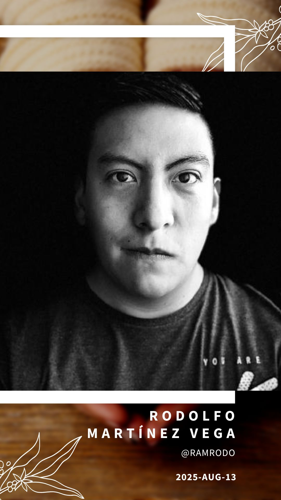

# In Memory of Rodolfo Martínez Vega

Dear community and friends,

I thought it might be a good idea for us all to gather our thoughts, memories and stories of Rodolfo and what he meant to us in one place.

Please add your contribution below via a pull request.

## Victor Morales

I had the privilege of working with Rodo on multiple initiatives over the past few years,
and I want to share just a few of the many things that made him the extraordinary person he was.

First and foremost was his true community spirit.
Guadalajara is well known for its vibrant tech communities, inspired by Silicon Valley models.
Rodo, who grew up in Mexico City, decided early in his career to move to Guadalajara to pursue his dream of being part of this thriving ecosystem.

He co-founded the Go Lang community and played a key role in reviving the Cloud Native community.
Not stopping there, he was instrumental in organizing both Kubernetes Community Days (KCDs)
in Guadalajara—taking the lead on the second one until leukemia forced him to step back.
His active contributions to translating the CNCF glossary and Kubernetes documentation into Spanish were essential in achieving those projects' success.

I learned many things from him—not only as a professional but, more importantly, as a friend.
His passing is a tremendous loss for the CNCF LATAM community.
We will deeply miss him. I hope his family, like so many of us, will find strength in his legacy and the lives he touched.

## Edith Puclla

I met Rodolfo through his contributions to the Kubernetes documentation, especially in translating from English to Spanish. I was impressed by his strong focus on community and his mindset of always delivering excellent work.
I had the opportunity to attend one of his talks alongside Víctor Morales in Guadalajara, Mexico, and it was inspiring to see all that they achieved together in the Spanish translation community.

Rodolfo was collaborative, diligent caring for his team, always contributing, providing, and striving for something better, all with an incredible smile and humility.

Rodolfo, I will always remember you for what you were: a great human being and an example to follow.

My thoughts and prayers are with his family during this difficult time.

Thank you for evertything, Rodolfo and rest in peace. 🌹

## Carol Valencia

Rodolfo had a profound impact and was a true inspiration in how he shared his knowledge, time, dedication, and charisma with the community.

I first met him while working on the Kubernetes Spanish localization team alongside Víctor. He was always there to support and help everyone, making a real difference—especially for beginners or newcomers to the group.

He actively contributed to Kubernetes releases and inspired me to apply as well. He never hesitated to answer my questions, no matter how small.

After almost three years together in the Spanish localization team, Rodolfo became not just a colleague but a friend. It was a joy to meet him in person at several Kubecons, the last time in Salt Lake City—where we spoke, as always, about how to collaborate and support the Latin American community.

We will deeply miss his presence. Until the very end, he was contributing, answering questions, and merging pull requests for the community.

Those of us who had the privilege to know him will never forget his kindness and his unwavering dedication to helping others.

Rest in peace, Rodolfo. My heartfelt condolences and a warm embrace to his family and friends during this difficult time.

From where you are, you will always be an inspiration, and we will strive to follow in your footsteps.

## Abraham López

I met Rodo in 2018 while working at a startup incubator in Guadalajara, Jalisco, México. He moved from Estado de México to Guadalajara in order to pursue his dream. Leaving your familiy behind and everything you are familiar with must be incredible hard.

He was a Python developer who gladly took the challenge of becoming a Front-End developer. He was the kind of man that, whenever he set a goal for himself, worked relentlessly towards it until he was succesful. Yes, he became a great FE dev, I'm sure he was fantastic at infrastructure tasks as well.

His love for finances got him a position in a fintech startup owned by the incubator we worked at. He was a perfect fit. We then parted ways and pursued different careers in different companies. But, I deeply missed his contagious laugh, super-friendly manners and his constant state of joy.

He and Gustavo Díaz created GoLang GDL. He contributed to open source. Bought his own apartment before he was 30, it's worth saying that Guadalajara's real state is not exactly buyer friendly. Got a girlfriend. Proposed to her in Paris. And, left a mark in everyone who had the pleasure of working with him.

Rodomar, Ramrodo, Rodo, you are an inspiration to us all. You will be missed.

_"What is grief, if not love persevering?"_

